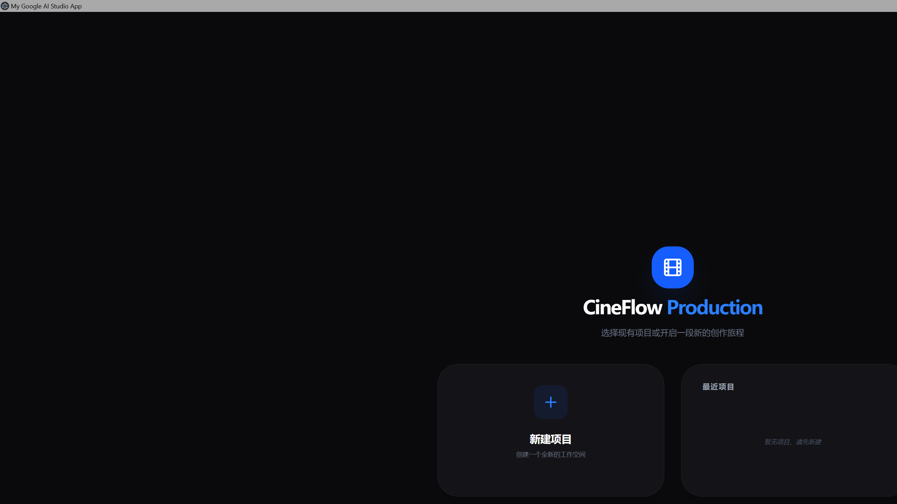
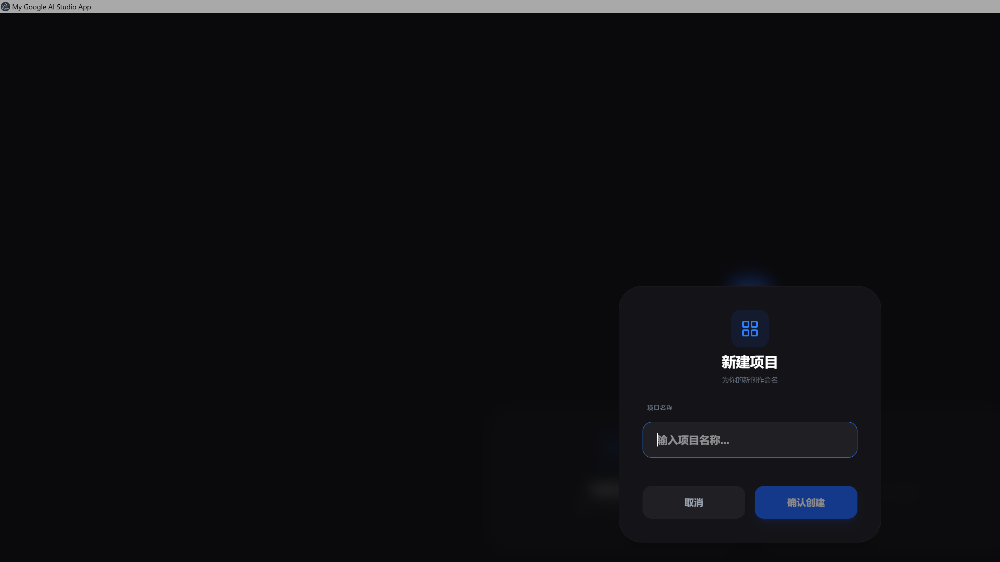
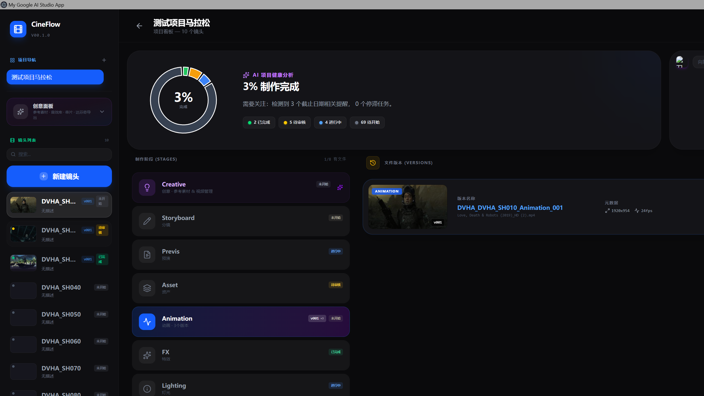
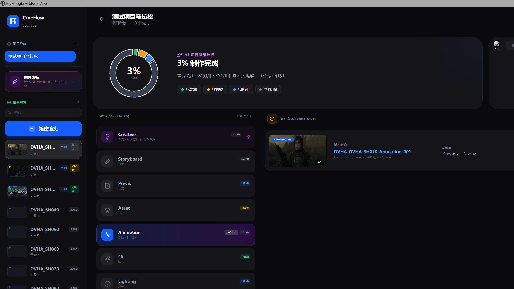
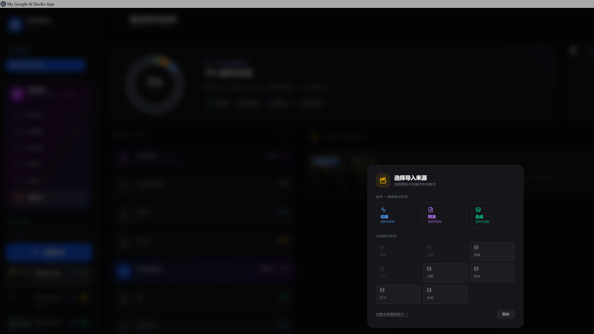
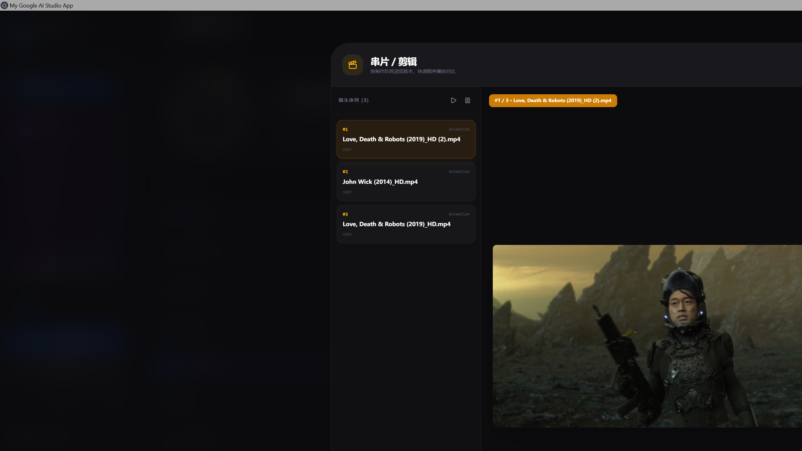

# 🎬 CineFlow — 专业影视后期创意资产管理工具

<div align="center">

**CineFlow Production** 是一款面向影视后期团队的桌面端创意资产管理工具，帮助创作者高效管理视频参考、镜头资产、版本迭代。

[](https://github.com/fengxz2333/CineFlow)
[](LICENSE)
[](https://www.electronjs.org/)
[](https://react.dev/)
[](https://typescriptlang.org/)

</div>

---

## ✨ 功能概览

| 模块 | 说明 |
|------|------|
| 🏠 **项目工作区** | 多项目管理、AI 进度分析、制作阶段追踪 |
| 🎬 **视频参考板** | 导入视频素材、悬停预览、分类标签、全屏播放 |
| 🖼️ **图片参考画布** | PureRef 风格无限画布、拖拽排版 |
| 🎵 **音频库** | 音乐/音效管理、波形可视化、播放预览 |
| 🎞️ **镜头管理** | Shot 级别独立素材隔离、版本对比 |
| 📦 **资产库** | 统一素材归档、全文搜索、标签筛选 |

---

## 📸 界面预览

### 1. 首页 — 项目门户
启动后进入首页，可快速新建项目或打开最近项目。

<p align="center">

</p>

### 2. 新建项目
支持自定义项目名称，一键创建独立工作空间。

<p align="center">

</p>

### 3. 项目工作区
核心工作界面 — 左侧边栏（制作阶段 + 创意面板 + 镜头列表）、中央区域（AI 项目概览 + 制作阶段卡片）、右侧版本预览面板。

<p align="center">

</p>

### 4. 创意面板 & 镜头列表
左侧边栏集成创意视频参考与 Shot 镜头管理。

<p align="center">

</p>

### 5. 素材导入
支持多种导入方式：录制、序列导入、拖放文件/目录。

<p align="center">

</p>

### 6. 视频预览播放
内置视频播放器，支持帧精确导航和片段循环。

<p align="center">

</p>

---

## 🚀 快速开始

### 方式一：下载免安装版（推荐）

1. 前往 [Releases](https://github.com/fengxz2333/CineFlow/releases) 页面
2. 下载 `CineFlow.exe`（~106MB）
3. **双击即可运行**，无需安装

### 方式二：从源码运行

```bash
# 克隆仓库
git clone https://github.com/fengxz2333/CineFlow.git
cd CineFlow/cineflow-asset-manager

# 安装依赖
npm install

# 开发模式（浏览器）
npm run dev

# Electron 桌面模式
npm run electron:dev

# 打包为 EXE
npm run electron:build
```

> **环境要求**：Node.js 18+ / npm 9+ / Windows 10+ (64位)

---

## 🛠 技术栈

| 层级 | 技术 |
|------|------|
| **桌面壳** | Electron 41 |
| **前端框架** | React 19 + TypeScript 5.7 |
| **构建工具** | Vite 6 |
| **状态管理** | React Hooks + Context API |
| **样式方案** | Tailwind CSS 4 |
| **UI 组件** | Flux UI (shadcn/ui 风格) |
| **数据存储** | IndexedDB (via idb) + localStorage |
| **图标库** | Lucide Icons |

---

## ⚡ 核心功能详解

### 🎥 视频参考板
- 支持 MP4/MOV/WebM 等主流格式
- **悬停自动循环预览** — 鼠标悬停即时播放缩略图
- 单击全屏弹窗播放
- 拖拽排序、批量删除、标签分类

### 🎞️ 制作阶段系统
- 内置 7 大标准阶段：Creative → Storyboard → Previs → Asset → Animation → FX → Lighting
- 每个 Stage 独立素材空间
- AI 驱动的项目完成度分析

### 📂 镜头 (Shot) 管理
- Shot 级别数据完全隔离
- 版本号管理（v001, v002...）
- 关联参考素材、备注标注

### 🔍 搜索与筛选
- 全文模糊搜索文件名
- 多维度标签筛选
- 文件类型过滤（视频/图片/音频）

---

## ✅ 当前优点

- ✅ **完整的桌面应用体验** — Electron 打包，开箱即用
- ✅ **暗色主题 UI** — 专业影视风格，长时间使用不刺眼
- ✅ **视频悬停预览** — 双层 video 结构，静帧→动效平滑过渡
- ✅ **多项目管理** — 支持切换不同影视项目
- ✅ **Shot 级数据隔离** — 全局参考 vs 镜头参考互不干扰
- ✅ **本地存储** — 所有数据存于本地 IndexedDB，隐私安全
- ✅ **免安装分发** — Portable EXE 格式，U盘即插即用
- ✅ **响应式布局** — 左侧边栏 + 中央工作区 + 右侧预览三栏设计

## ⚠️ 已知限制 / 待完善 (半成品)

- 🔧 **GitHub 上传功能未接入** — 当前需手动操作 Git/GitHub
- 🔧 **导出功能不完整** — 项目报告/PDF 导出待实现
- 🔧 **协作功能缺失** — 暂仅支持单机使用，无云端同步
- 🔧 **部分设置项为占位** — 快捷键自定义、主题色调整等 UI 已搭建但逻辑待补全
- 🔧 **大文件处理优化** — 超过 2GB 的视频文件可能存在性能瓶颈
- 🔧 **Mac/Linux 未测试** — 目前仅在 Windows 10/11 64位上验证
- 🔧 **无自动更新机制** — 需手动下载新版本替换
- 🔧 **部分模态框动画可进一步优化**

> 📌 本项目作为 **半成品 (Alpha)** 开源发布，核心框架已可用，部分高级功能持续开发中。欢迎 Issue 和 PR！

---

## 📁 项目结构

```
cineflow-asset-manager/
├── src/
│   ├── App.tsx              # 主应用组件 (~7000行)
│   ├── components/          # UI 组件库
│   ├── hooks/               # 自定义 Hooks
│   ├── types/               # TypeScript 类型定义
│   └── utils/               # 工具函数
├── public/                  # 静态资源
├── electron-main.js         # Electron 主进程
├── package.json             # 项目配置
├── vite.config.ts           # Vite 构建配置
├── tailwind.config.ts       # Tailwind 配置
└── tsconfig.json            # TypeScript 配置
```

---

## 📄 License

[MIT](LICENSE) © 2026 fengxz2333

---

## 🙏 致谢

- [Electron](https://www.electronjs.org/) — 跨平台桌面应用框架
- [React](https://react.dev/) — UI 框架
- [Vite](https://vitejs.dev/) — 极速构建工具
- [Tailwind CSS](https://tailwindcss.com/) — 原子化 CSS
- [Lucide](https://lucide.dev/) — 开源图标库
- [shadcn/ui](https://ui.shadcn.com/) — UI 设计灵感

---

<div align="center">

**⭐ 如果这个项目对你有帮助，请给一个 Star！⭐**

Made with ❤️ by [fengxz2333](https://github.com/fengxz2333)

</div>
